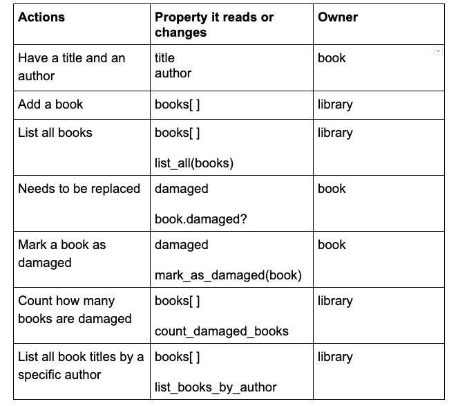
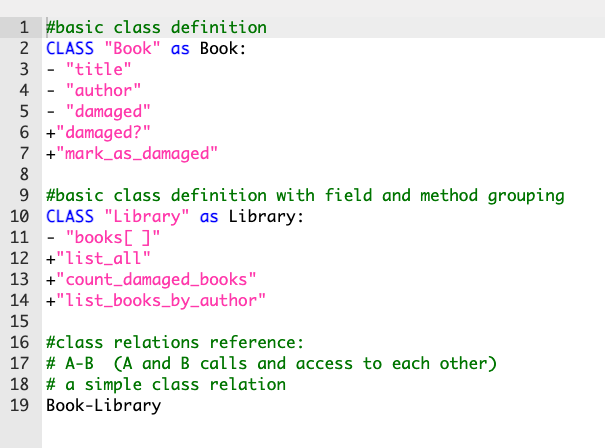
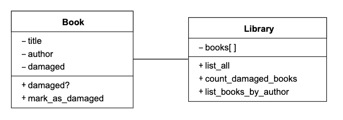

# Week 4 \(Mon 27 Sept - Fri 1 Oct\)

## Monday 27 September

Coach this week: Alice Lieutier, Topic: TDD & OOD

### Week 4: Object-Oriented Design

[https://github.com/makersacademy/course/blob/main/apprenticeship\_module\_outlines.md\#week-4-object-oriented-design](https://github.com/makersacademy/course/blob/main/apprenticeship_module_outlines.md#week-4-object-oriented-design)

9.30: Peer group

10.00: - kick off, week's focus, demo of code review first steps. 

Code review scaffold [https://github.com/makersacademy/skills-workshops/tree/main/object\_oriented\_programming/code\_review](https://github.com/makersacademy/skills-workshops/tree/main/object_oriented_programming/code_review)

10.45: - code review \(Airport challenge\) in pairs

12.00: - plenary session with Roi

14.00: - Oystercard  
I learned about `attr_reader`  and enjoyed pairing with [@Khalid Miah](https://makersapprenticeships.slack.com/team/U02AYMSAK7F) and [@Alex Wintle](https://makersapprenticeships.slack.com/team/U02BEBB3FB3)  

## Tuesday 28 September

9.30: Peer group

10.00: - workshop about domain modelling with Alice. "Modelling is an essential skill as a developer, as it allows you to plan code you’ll write, and communicate what you’ll do, before you even start writing the code"

Looked at using the diagram.codes website [https://playground.diagram.codes/d/class\_diag](https://playground.diagram.codes/d/class_diag)

```text
#basic class definition with field and method grouping
CLASS "Cohort" as Cohort:
-"students"
+"add(student)"
+"student_list()"
+"present_student_count()"

CLASS "Student" as Student:
-"name"
-"present?"
+"sign_in()"
+"sign_out()"

# class relation
Cohort-Student
```

Worked with Tom and Kirsty, looking at book / library user stories.







14.00: Afternoon - pairing with Hassan on Oystercard

## Wednesday 29 September

9.30: Peer group

11.00: - looked at "accessing a constant outside the class" with Steve and Hassan. 

Global variable, instance variable, constant. Ruby syntax. @, ::

14.00: Afternoon - pairing

## Thursday 30 September

9.30: Peer group

10.00: \(Digital Voices training session\)

Alice: OOD exercise [https://github.com/alicelieutier/OOD\_exercise](https://github.com/alicelieutier/OOD_exercise)

11.30am - live coding: extracting a class

recording [https://drive.google.com/file/d/1sJstn3yO8ve5Wf6JI6U\_ZfSJrkTs7Jiq/view?usp=sharing](https://drive.google.com/file/d/1sJstn3yO8ve5Wf6JI6U_ZfSJrkTs7Jiq/view?usp=sharing)

Alice later provided code for her Match class 

14.00: Afternoon - pairing

## Friday 1 October

Punctuality survey from Eddie: [https://airtable.com/shrvjiwmDA3zCTv6I](https://airtable.com/shrvjiwmDA3zCTv6I)

9.30: Peer group

11.00: End of unit challenge - Office Management

[https://github.com/makersacademy/office-management-challenge](https://github.com/makersacademy/office-management-challenge)

15.00: Retro


